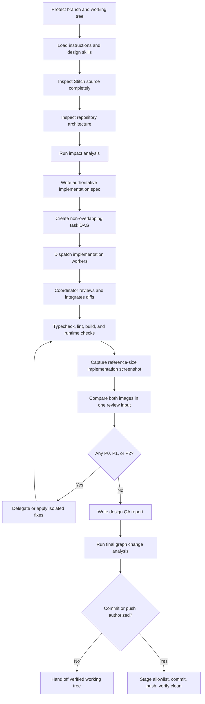

# Stitch Mobile UI Implementation Agent Workflow (historical V1 reference)

This document is not authoritative for new runs. Use `docs/agents/workflows/stitch-ui.md` for V2.

Use this workflow when implementing an Expo/React Native mobile screen from a Google Stitch project or another screenshot-backed design source. It is written for a coordinating agent that owns architecture and quality while delegating bounded implementation work to subagents.

This document is both:

- a reusable procedure for future screens; and
- a case study of the `Profile & Farm Settings` implementation completed for this repository.

`AGENTS.md`, the current repository, and the requested design source remain authoritative. If this workflow conflicts with a newer repository instruction, follow the newer repository instruction and record the deviation in the task artifacts.

## 1. Operating contract

The coordinator owns the result. Delegation distributes execution; it does not distribute architectural authority.

### Coordinator responsibilities

The coordinator must:

1. protect the user's branch and working tree;
2. load applicable repository instructions and skills;
3. inspect the complete Stitch source before implementation;
4. inspect the existing architecture before choosing files or components;
5. run required impact analysis before editing code;
6. write one authoritative implementation specification;
7. decompose the work into non-overlapping file ownership;
8. give workers narrow, testable task packets;
9. review every worker diff;
10. integrate and verify the complete screen;
11. perform a same-size design-versus-implementation visual comparison;
12. drive P0, P1, and P2 findings to zero;
13. run repository checks and graph change analysis;
14. commit or push only when explicitly authorized; and
15. report unresolved risks and pre-existing failures separately.

### Subagent responsibilities

A subagent is an executor. A worker must:

1. read the coordinator's task packet and authoritative spec;
2. edit only the assigned files;
3. reuse the named repository patterns and dependencies;
4. implement the supplied visual facts without redesigning them;
5. avoid unrelated refactors;
6. run the requested narrow checks;
7. report changed files, assumptions, check results, and unresolved issues; and
8. stop and escalate when the task requires a new file, dependency, architectural decision, or overlapping ownership that the packet did not authorize.

### Hard phase gates

Implementation code begins only after all four gates are complete:

- Stitch inspection complete;
- repository inspection complete;
- implementation specification written; and
- task decomposition and file ownership written.

Visual completion requires all of these gates:

- runnable implementation;
- implementation screenshot captured at the reference viewport and state;
- reference and implementation reviewed together;
- P0/P1/P2 punch-list items resolved or explicitly blocked;
- interactions exercised;
- console/runtime errors checked; and
- `design-qa.md` ends with `final result: passed` or an honest `final result: blocked`.

Compiling is not visual completion.

## 2. Workflow state machine



Each arrow is a gate. Do not jump from design retrieval to coding, or from compilation directly to completion.

## 3. Agent and model strategy

### What was used for Profile & Farm Settings

The coordinator role was `Sol`, as required by the task. Every worker was spawned with full task context and no explicit model override. Therefore, the workers inherited the parent model and reasoning effort. The exact deployed model snapshot was not overridden or independently selected during this run.

| Agent | Role | Context strategy | Model selection | Owned files |
| --- | --- | --- | --- | --- |
| Main coordinator | Source inspection, architecture, spec, task DAG, integration, visual QA, Git safety, final review | Full conversation and repository context | Parent `Sol` role | Cross-cutting review; artifacts; Git operations |
| `account_fonts` | Obtain and wire exact Manrope/Public Sans font files | Full fork | Inherited parent model | `src/screens/account/fonts.ts`, `assets/fonts/*` |
| `account_icons` | Add only missing icon mappings | Full fork | Inherited parent model | `src/screens/home-dashboard/icons.tsx` |
| `account_screen` | Implement the screen from the authoritative spec | Full fork | Inherited parent model | `src/screens/account/index.tsx` |
| `integration_review` | Independent read-only spec-versus-code review | Full fork | Inherited parent model | No edits |
| `responsive_web_tabs` | Fix the isolated narrow-web navigation mismatch discovered during visual QA | Full fork | Inherited parent model | `src/components/app-tabs.web.tsx` |

The coordinator reused `account_screen` for sequential polish follow-ups. It did not run two agents against `src/screens/account/index.tsx` concurrently.

### Recommended model policy for future runs

Prefer inheritance unless there is a concrete reason to override. Model names and availability may change; inspect the current runtime before dispatch.

If the current runtime exposes the following model families, use this as guidance:

| Work type | Recommended model | Reasoning effort | Context fork |
| --- | --- | --- | --- |
| Coordinator, architecture, integration, final visual judgment | `gpt-5.6-sol` | high or xhigh | full context |
| Complex React Native implementation worker | `gpt-5.6-terra` or inherited Sol | medium or high | enough recent turns to include the complete task packet and spec |
| Small additive icon/token/asset task | `gpt-5.6-luna` or `gpt-5.4-mini` | medium | bounded recent turns or no history plus a self-contained packet |
| Independent regression/design review | `gpt-5.6-sol` or `gpt-5.6-terra` | high | full context or a complete review packet |

Use these rules:

1. A full-history fork inherits the parent model and reasoning effort. Do not request a model override with a full-history fork if the collaboration runtime disallows that combination.
2. To override a model, use a bounded recent-turn fork or no-history fork and make the task packet self-contained.
3. Use a stronger model for ambiguity, shared architecture, integration, or visual judgment.
4. Use a faster model only for deterministic tasks with exact file ownership and acceptance criteria.
5. The coordinator always performs the final review, regardless of worker model.

## 4. Standard artifact layout

Use a stable screen slug such as `profile-farm-settings`.

```text
.stitch/<screen-slug>/
  stitch-screen.html
  stitch-screen-original.png
  stitch-screen-<css-width>.png
  <downloaded-source-assets>
  implementation-<route>-<css-width>.png

artifacts/stitch/<screen-slug>/
  implementation-spec.md
  visual-qa.py              # only when a reusable QA script is useful

design-qa.md                # current screen's final comparison report
```

Rules:

- Preserve the original downloaded source separately from resized inspection copies.
- Record actual pixel dimensions; do not rely only on Stitch metadata.
- Use source assets already present in the repository when they are visually identical.
- Keep the implementation screenshot used for the final pass.
- If `design-qa.md` already describes another screen, preserve it in that screen's artifact folder before replacing it.

## 5. Detailed procedure

### Phase 0 — Protect the branch and working tree

Goal: establish a reversible baseline before inspecting or editing.

1. Run `git status --short` and `git branch --show-current`.
2. Identify every modified, staged, and untracked path.
3. Classify each path as:
   - requested scope;
   - coordinator-generated task artifact;
   - unrelated user work; or
   - unknown ownership.
4. Preserve unrelated changes. Prefer a path-scoped stash or a separate worktree/branch when a checkout would otherwise overwrite them.
5. Confirm the requested target branch. If it does not exist and the user asked for it, create it explicitly.
6. Never use broad destructive cleanup to obtain a clean tree.

Completion criterion: the coordinator can name the current branch, every dirty path, which paths belong to the task, and how unrelated work is preserved.

#### Branch-change pattern

```bash
git status --short
git branch --show-current
git branch --list '<target-branch>'
git branch -r --list 'origin/<target-branch>'
```

When carrying work through a checkout:

```bash
git stash push -u -m '<descriptive-backup-name>'
git switch '<target-branch>'
git stash apply '<exact-stash-ref>'
```

Resolve any conflict narrowly, retain the backup stash until the result is verified, and do not infer that an unrelated conflict belongs to the task.

### Phase 1 — Load current instructions and tools

Goal: ground the run in current repository and framework rules.

1. Read `AGENTS.md` from the repository root and any closer nested instruction file.
2. Read this workflow completely.
3. Load the design-to-code or screenshot-to-code skill required by the runtime.
4. Load the browser/webapp-testing skill before direct browser automation.
5. For this repository, read the exact Expo SDK 57 documentation before writing code.
6. Use Context7 when current library, framework, SDK, API, or CLI behavior is needed.
7. If `.codegraph/` exists, use CodeGraph before text search for code architecture questions.
8. If `.gitnexus/` exists, follow the impact and change-analysis gates in `AGENTS.md`.

Completion criterion: the coordinator has named the applicable instructions, framework version, visual implementation skill, browser strategy, and code-intelligence strategy.

### Phase 2 — Inspect Stitch completely

Goal: convert the remote design into locally inspectable evidence before implementation.

1. Retrieve project metadata.
2. Retrieve the exact screen by project ID and screen ID.
3. List project screens to detect related states or variants.
4. Retrieve every available source:
   - screenshot;
   - generated HTML/code;
   - design metadata/theme;
   - hosted images;
   - icons or asset URLs; and
   - state/interaction hints.
5. Download hosted URLs with redirect support, for example `curl -L`.
6. Inspect the original screenshot at full resolution.
7. Normalize a copy to the intended CSS width without replacing the original.
8. Inspect the generated code and theme configuration. Record custom token overrides; names such as `rounded-full` may not mean their framework defaults.
9. Measure and record:
   - canvas size and background;
   - safe-area behavior;
   - fixed, sticky, and scrolling regions;
   - section hierarchy;
   - horizontal and vertical spacing;
   - width and height constraints;
   - typography family, size, line height, weight, and tracking;
   - colors and opacity;
   - borders, radii, and shadows;
   - asset slots and crop modes;
   - icon names and sizes;
   - interactive controls and default states;
   - responsive behavior; and
   - bottom navigation ownership.
10. Reconcile conflicting evidence. Prefer the actual downloaded pixels and generated source over a summary field that disagrees with them.

Completion criterion: all available Stitch sources are local, visually inspected, and summarized with exact measurements and behaviors.

#### Profile & Farm Settings example

- Stitch project: `AgriFinance Market Tracker` (`16177202758777999982`).
- Screen: `Profile & Farm Settings` (`0f8d30f6f5ce44c199b0493d9dd77bc2`).
- Stitch metadata reported `780 × 2916`, but the original hosted image was `780 × 3276`.
- The original was interpreted as a `390 × 1638` CSS-pixel capture at 2× density.
- The generated Tailwind theme redefined `rounded-full` as `12px`. Therefore the 80px profile image was a 12px-radius rounded square, not a circle.
- The app already contained visually matching optimized logo and profile assets, so the implementation reused them.

### Phase 3 — Inspect the repository architecture

Goal: determine how this screen belongs in the existing application.

Answer these questions before writing the spec:

1. Which route owns the screen?
2. Is the route a thin adapter or the implementation file?
3. Which navigation shell wraps it?
4. Which parent owns top and bottom safe areas?
5. Which components already implement headers, text, cards, rows, icons, and tabs?
6. Which design tokens already match the source?
7. How are images and fonts loaded?
8. Which state-management pattern fits each interaction?
9. Which platform-specific files exist?
10. Which scripts perform typecheck, lint, test, build, and preview?
11. Which existing changes are unrelated and must remain untouched?

Use CodeGraph for symbols, call paths, and architecture. Use targeted text search for literals, assets, and any `UNKNOWN` graph result.

For Profile & Farm Settings, the relevant findings were:

- `src/app/(tabs)/account.tsx` was already a thin route adapter.
- `src/screens/account/index.tsx` was the implementation owner.
- native navigation used `src/components/app-tabs.tsx`;
- web navigation used `src/components/app-tabs.web.tsx`;
- `ThemedText`, `ThemedView`, `Colors`, `Spacing`, `Radius`, `BottomTabInset`, `useTheme`, and the shared `Icon` component were reusable;
- `expo-font` was already installed; and
- the screen required no new route or state-management architecture.

Completion criterion: the coordinator can state the target route, implementation file, reusable components, tokens, navigation/safe-area owners, state pattern, assets, and verification commands.

### Phase 4 — Run pre-edit impact analysis

Goal: understand blast radius before assigning files.

1. Run GitNexus impact analysis for every function, component, class, or shared symbol that may be edited.
2. Record the result in the implementation spec or worker packet.
3. Warn the user before editing a HIGH or CRITICAL target.
4. Treat `UNKNOWN` as unresolved.
5. Resolve `UNKNOWN` with targeted text search or direct source inspection before proceeding.
6. Prefer additive edits for shared registries such as icon maps.

Profile & Farm Settings examples:

- `Account` had LOW upstream risk and one route caller.
- `ICONS` returned `UNKNOWN` because access occurred through `ICONS[name]`; targeted search confirmed the shared lookup and the edit was kept additive.
- `CustomTabList` and `TabButton` had LOW risk with one direct caller.
- `AppTabs` was ambiguous/`UNKNOWN` because native and web symbols shared a name; targeted search confirmed that the tabs layout was the only importer.

Completion criterion: every planned code owner has a recorded risk verdict, and every `UNKNOWN` result has corroborating evidence.

### Phase 5 — Write the authoritative implementation spec

Goal: create one source of truth that workers execute without reinterpreting the design.

Write `artifacts/stitch/<screen-slug>/implementation-spec.md` with:

1. source IDs and local evidence paths;
2. route and architecture decisions;
3. component hierarchy;
4. exact layout measurements;
5. typography;
6. colors and elevation;
7. exact copy and data;
8. asset mapping;
9. icon mapping;
10. interactions and default states;
11. safe-area and scrolling behavior;
12. mobile/web/tablet responsive behavior;
13. reusable existing components;
14. new private components/helpers;
15. planned file ownership;
16. impact-analysis verdicts; and
17. acceptance criteria.

The spec must explicitly resolve architecture-versus-Stitch conflicts. For this screen, the repository's existing navigation model remained authoritative, so the implementation did not create a second screen-local bottom bar. A narrow web presentation of the existing four tabs was later added when visual QA showed the desktop tab shell breaking the mobile viewport.

Completion criterion: another agent can implement its assigned slice using only the task packet, the spec, and named repository files.

### Phase 6 — Decompose into a task DAG

Goal: maximize useful parallelism while preventing conflicting edits.

Good task boundaries are file-based and independently verifiable:

- font/assets worker;
- icon-registry worker;
- screen implementation worker;
- read-only integration reviewer;
- platform-specific navigation worker; and
- isolated polish worker.

Use these rules:

1. One concurrent owner per file.
2. Shared-file edits are small and additive.
3. Workers receive exact Stitch facts relevant to their slice.
4. Workers do not independently reinterpret the entire design.
5. The main screen worker starts only after dependencies and mappings are specified, though files may be implemented in parallel when imports are agreed in advance.
6. Read-only review can run after initial integration.
7. Follow-up edits to a previously owned file go back to the same worker sequentially when practical.
8. The coordinator handles cross-file decisions and resolves inconsistencies.

#### Task packet template

```markdown
Task: <bounded result>

Authoritative spec:
- <absolute or repository-relative path>

Exact scope:
- Own: <files>
- Read-only references: <files>
- Do not edit: <files or areas>

Relevant Stitch facts:
- <measurements, tokens, assets, state>

Repository patterns:
- <components, hooks, route conventions>

Impact verdict:
- <symbol, risk, callers, corroboration>

Acceptance criteria:
- <observable result>
- <required checks>

Report:
- changed files
- assumptions
- command results
- unresolved issues
```

Completion criterion: every planned file has exactly one concurrent owner, every worker has a complete task packet, and dependencies form an acyclic execution order.

### Phase 7 — Dispatch and supervise workers

Goal: obtain narrow diffs that can be independently reviewed.

1. Spawn each worker with the smallest context strategy that still makes the packet complete.
2. Prefer full context when the worker must understand prior architecture decisions.
3. Prefer a bounded or no-history fork for deterministic work when using a lower-cost model.
4. Track agent name, status, owned files, and dependencies.
5. Wait in meaningful intervals; do not busy-poll.
6. If a worker reports a blocker, decide centrally whether to revise the spec, reassign ownership, or stop for user direction.
7. When a review finds an isolated issue, send a precise follow-up to the owner rather than reopening the entire design.

#### Coordinator status table

| Worker | Scope | Status | Dependency | Result |
| --- | --- | --- | --- | --- |
| `<name>` | `<files/result>` | pending/running/completed/blocked | `<dependency>` | `<summary>` |

Completion criterion: every worker is completed or explicitly blocked, and the coordinator has a result report for every task.

### Phase 8 — Review and integrate every diff

Goal: ensure worker output follows both the spec and repository conventions.

For each diff, check:

1. only assigned files changed;
2. no unrelated refactor was introduced;
3. imports and dependencies match the existing project;
4. shared maps were changed additively;
5. local helpers remain private unless reuse was specified;
6. exact copy and realistic data match the source;
7. styles use the specified measurements and tokens;
8. assets are real and correctly cropped;
9. controls expose roles, labels, state, hit targets, and pressed feedback;
10. scrolling and safe-area ownership remain correct; and
11. worker-reported checks actually pass from the integrated tree.

Run an independent read-only review after the first integration. Give that reviewer the spec, Stitch HTML, screenshot paths, and changed files. Require exact file/line evidence and P0/P1/P2/P3 severity.

Completion criterion: the coordinator has reviewed every changed line or binary asset provenance, and all P0/P1/P2 code-review findings are resolved or carried into visual QA.

### Phase 9 — Run automated verification

Goal: catch integration failures before visual judgment.

Run in this order:

1. `git diff --check`;
2. targeted lint on changed source files;
3. `npm run typecheck`;
4. relevant tests, when present;
5. application build or dev-server bundle; and
6. full `npm run lint`.

When the full repository check fails in an untouched file:

- confirm the file is outside the diff;
- report it as pre-existing;
- keep the task-scoped checks green; and
- avoid fixing unrelated code without authorization.

In this case, task-scoped lint and typecheck passed. Full lint continued to report the pre-existing `react-hooks/set-state-in-effect` error in `src/hooks/use-color-scheme.web.ts:11`, which was not modified.

Completion criterion: task-scoped code is clean, the app bundles, and every repository-wide failure is classified as introduced or pre-existing.

### Phase 10 — Perform browser/device visual QA

Goal: compare rendered pixels and behavior, not implementation intent.

1. Start the actual application route.
2. Use the user's selected browser surface.
3. If the selected browser is unavailable and direct Playwright is needed, obtain user permission before using it.
4. Capture the implementation at the same CSS width, viewport height, density, theme, locale, and state as the source.
5. Wait for network idle, route content, and `document.fonts.ready`.
6. Capture a full-page screenshot.
7. Verify screenshot pixel dimensions.
8. Put the reference and implementation screenshots into the same visual comparison input.
9. Review:
   - spacing and alignment;
   - component dimensions;
   - typography and wrapping;
   - colors and opacity;
   - radii, borders, and shadows;
   - asset crop and quality;
   - icons;
   - safe areas;
   - scroll behavior;
   - fixed/sticky regions;
   - horizontal overflow;
   - default and changed control states; and
   - mobile navigation.
10. Exercise core interactions.
11. Capture console errors, page errors, and failed requests.
12. Classify findings:
   - P0: screen unusable, missing, or unverifiable;
   - P1: major visible/functional mismatch;
   - P2: meaningful fidelity/accessibility mismatch;
   - P3: minor polish or intentional architecture difference.
13. Fix P0/P1/P2 issues and repeat from the automated checks.

#### Profile & Farm Settings QA history

1. The in-app browser client failed because its runtime prohibited importing `node:process`.
2. After permission, a temporary Python Playwright environment used installed Google Chrome.
3. The first capture reported `scrollWidth: 486` at a 390px viewport. The desktop web tab shell covered the header and forced horizontal overflow.
4. A worker added a narrow-width bottom presentation of the existing web tabs, while preserving desktop and native navigation.
5. The second capture matched the document width but revealed that `Link asChild` dropped the function-style notification surface on web. The fixed 44px visual well moved to an inner `View`.
6. Playwright also showed that the controlled switch changed visually but exposed no `aria-checked`; an explicit ARIA prop corrected it.
7. The final capture was exactly `780 × 3276`, with viewport `390 × 1638`, document width `390`, fonts loaded, no console/page errors, and switch state `true → false → true`.
8. The final reference and implementation were inspected together.

Completion criterion: the final comparison has zero P0/P1/P2 findings and a reproducible screenshot plus interaction/error evidence.

### Phase 11 — Write the visual QA report

Goal: leave auditable evidence for later sessions.

`design-qa.md` must include:

- source path and dimensions;
- implementation route and screenshot path;
- viewport, density, theme, locale, and state;
- layout/overflow/font metrics;
- interaction results;
- console and page-error results;
- findings with severity;
- comparison history;
- a small remaining punch list; and
- the exact final line `final result: passed` or `final result: blocked`.

Never mark `passed` merely because the screenshot exists. The images must have been compared together.

Completion criterion: another reviewer can reconstruct what was compared, what failed earlier, what changed, and why the final result is trustworthy.

### Phase 12 — Final graph and Git safety

Goal: finish with a scoped, reviewable change set.

1. Run GitNexus change analysis after the final code edits.
2. If unrelated changes are present, run both:
   - task-relevant scope such as `unstaged` or an explicit staged allowlist; and
   - `all` when required by `AGENTS.md`.
3. Interpret HIGH/CRITICAL, `UNKNOWN`, partial, or truncated results conservatively.
4. Do not commit until graph analysis is complete.
5. If commit/push is authorized, stage an explicit allowlist rather than `git add .`.
6. Inspect `git diff --cached --name-only` and `git diff --cached --stat`.
7. Run staged `git diff --check`, targeted lint, typecheck, and staged graph analysis.
8. Commit with a scoped message.
9. Preserve unrelated dirty files with path-scoped stashes if the user requires a clean worktree.
10. Push the exact branch and verify local HEAD equals the remote tracking ref.

#### Safe staging example

```bash
git add -- \
  src/screens/<screen>/index.tsx \
  src/screens/<screen>/fonts.ts \
  src/components/<explicit-shared-file>.tsx \
  assets/fonts/<explicit-files> \
  .stitch/<screen-slug> \
  artifacts/stitch/<screen-slug> \
  design-qa.md

git diff --cached --name-only
git diff --cached --check
node .gitnexus/run.cjs detect-changes --scope staged --repo .
```

For Profile & Farm Settings, the coordinator committed only the explicit 21-file allowlist on `feat/profile-screen`. The unrelated commodity-detail edit and `.serena` config were stashed separately. Commit `6e5bcd7` was pushed, and local and remote refs were verified equal.

Completion criterion: the commit contains only requested files, the working tree state is intentional, and pushed/local commit IDs match when push was requested.

## 6. Reusable implementation-spec skeleton

```markdown
# <Screen name> implementation spec

## Source of truth
- Stitch project/title/ID
- Stitch screen/title/ID
- Local HTML and screenshot paths
- Actual pixel dimensions and CSS interpretation

## Architecture
- Route adapter
- Screen implementation owner
- Navigation owner
- Safe-area owner
- Existing patterns and dependencies

## Component hierarchy
<tree>

## Layout measurements
- Canvas/max width
- Header/body/footer dimensions
- Margins, gaps, padding
- Card/panel dimensions
- Scroll/fixed behavior

## Typography
- Family, size, line height, weight, tracking by role

## Colors and elevation
- Exact tokens and opacity
- Borders, radii, shadows

## Assets and icons
- Source-to-repository mapping
- Crop and slot sizes

## Exact content
- Copy, numbers, labels, states

## Interactions
- Control, initial state, action, feedback, accessibility

## Responsiveness
- Narrow phone, reference width, tablet/web

## Impact analysis
- Symbol, verdict, callers, corroboration

## File ownership
- Worker → owned files

## Acceptance criteria
- Visual
- Functional
- Accessibility
- Verification commands
```

## 7. Reusable visual-QA checklist

### Capture identity

- [ ] Correct route
- [ ] Correct screen state
- [ ] Correct CSS width and viewport height
- [ ] Correct density
- [ ] Correct light/dark theme
- [ ] Correct locale
- [ ] Fonts fully loaded
- [ ] Screenshot dimensions recorded

### Visual comparison

- [ ] Source and implementation viewed together
- [ ] No horizontal overflow
- [ ] Header and safe area align
- [ ] First-content offset aligns
- [ ] Card width, spacing, padding, and radius align
- [ ] Typography families and metrics align
- [ ] Text wrapping reviewed
- [ ] Colors and opacity align
- [ ] Shadows and borders align
- [ ] Assets use correct crop and resolution
- [ ] Icons match library, size, fill, and color
- [ ] Bottom navigation behaves as intended
- [ ] Long content scrolls and remains reachable

### Functional comparison

- [ ] Primary navigation works
- [ ] Links work
- [ ] Toggles change and restore state
- [ ] Inputs/selections behave
- [ ] Dialogs or feedback appear
- [ ] Accessibility role, label, and state are exposed
- [ ] Minimum hit targets are respected
- [ ] Console errors are empty
- [ ] Page errors are empty

### Completion

- [ ] P0 count is zero
- [ ] P1 count is zero
- [ ] P2 count is zero
- [ ] P3 items are documented
- [ ] `design-qa.md` final result is accurate

## 8. Failure patterns and corrections

### Coding before source inspection

Failure: workers invent layout or use a thumbnail as the source.

Correction: finish the Stitch evidence bundle and spec before dispatch.

### Letting every worker interpret the whole design

Failure: different workers select inconsistent spacing, radii, and abstractions.

Correction: the coordinator writes one authoritative spec and sends only relevant facts to each executor.

### Concurrent ownership of one file

Failure: workers overwrite each other or produce inconsistent local patterns.

Correction: one concurrent owner per file; send sequential follow-ups to the same owner.

### Trusting semantic token names

Failure: `rounded-full` is assumed to be a circle even when the design config overrides it.

Correction: inspect generated token values and the actual pixels.

### Trusting metadata dimensions

Failure: QA uses a metadata height that differs from the downloaded source.

Correction: record the original file's actual pixel dimensions and use them for capture.

### Treating compilation as fidelity

Failure: the screen compiles while a global shell covers the header or forces overflow.

Correction: run same-viewport browser QA and inspect document dimensions.

### Testing only screen-local components

Failure: the screen looks correct in isolation but the real route's navigation shell breaks it.

Correction: capture the real application route inside its actual layout.

### Assuming cross-platform accessibility output

Failure: React Native accessibility state works conceptually but no web ARIA attribute is emitted.

Correction: inspect rendered DOM/accessibility state and add the narrow explicit prop supported by current typings.

### Styling a `Link asChild` only with a function style

Failure: web link cloning drops the visual surface while preserving the child content.

Correction: keep pressed feedback on the outer control and place invariant dimensions/background on a fixed inner view.

### Reading `UNKNOWN` as safe

Failure: a shared registry appears unused because graph tooling cannot follow dynamic property access.

Correction: corroborate with targeted text search and keep the change additive.

### Staging everything in a dirty tree

Failure: unrelated user files enter the feature commit.

Correction: stage an explicit allowlist, inspect cached names, and stash unrelated paths separately only when a clean tree is requested.

### Hiding pre-existing failures

Failure: the handoff says checks pass while full lint fails in an untouched file.

Correction: report task-scoped passes and the exact pre-existing repository failure separately.

## 9. Definition of done

A Stitch screen implementation is complete only when:

1. source evidence is local and inspected;
2. repository architecture is understood and preserved;
3. pre-edit impact analysis is recorded;
4. the authoritative spec exists;
5. subagent ownership was non-overlapping;
6. every diff was reviewed by the coordinator;
7. task-scoped automated checks pass;
8. the real route renders at the reference viewport;
9. source and implementation were compared together;
10. P0/P1/P2 findings are zero or the task is honestly blocked;
11. interactions and accessibility state were verified;
12. `design-qa.md` records the evidence;
13. final graph change analysis is complete;
14. only authorized files are staged or committed; and
15. the final branch/worktree state is explicit.

The coordinator may then hand off the result, request user direction for a genuine blocker, or commit and push when authorized.
